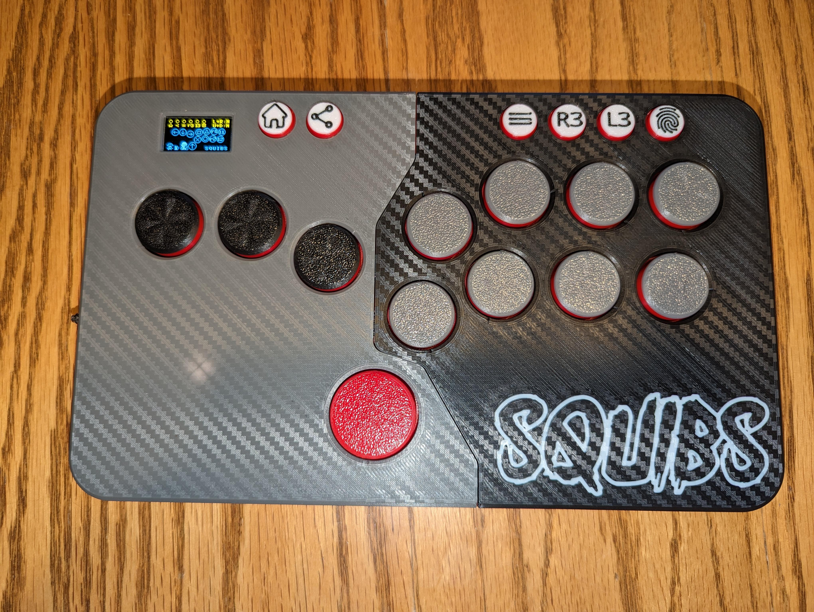
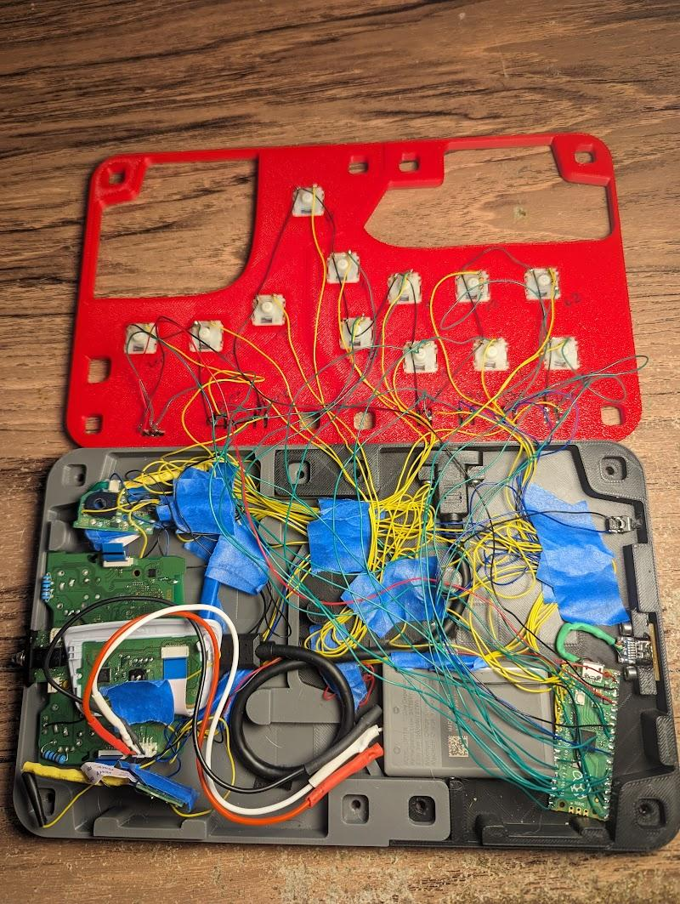

# DualSense Padhack

The following information is a combination of my previous padhack and my most recent. I wrote this guide for my last padhack on reddit, but have updated my latest one to use a Pi Pico instead of an arduino.

[My Reddit Razer Raion Padhack Post](https://www.reddit.com/r/fightsticks/comments/x4uc3p/3d_printed_hitbox_padhack_i_dont_even_play/)

[My First Reddit DualSense Padhack Post](https://www.reddit.com/r/fightsticks/comments/160oms2/back_with_another_padhack_dualsense_padhack/)

[**My Latest Reddit DualSense Padhack Post**](https://www.reddit.com/r/fightsticks/comments/1bri164/finally_happy_with_my_dualsense_padhack_3d_printed/)

I figured I would document the process a bit more, for those who would like to make one themselves. I found myself jumping around to various places and not really being able to find exact answers half the time when I was making this. Being pretty unexperienced in making things like this or working with electronics in general made it a bit harder as well. This is only the second project I've ever really done, so my soldering skills aren't quite there yet. Read on if you want to read through my random rambling.

## Notes

I would say that most of the information I got from this project came from [/u/fluffhead123](https://www.reddit.com/r/fightsticks/comments/pnh56j/dualsense_5_padhack/), and from the [acidmods forum](https://acidmods.com/forum/index.php?topic=44714.0) with the pcb scans / information from RDC and other community members.

Again I'm not experienced at all at this sort of thing so my explanations might be total nonsense.

***As a pre-note to everything, I recommend leaving all daughterboards ribbons disconnected until you solder everything. The ribbon cables can only handle so many disconnections before the traces start to fray.***

## Used Equipment

I recently upgraded my soldering iron, which is another reason why I wanted to try another padhack. I was previously using an ancient *Weller SP40L*, with a completely destroyed tip; as that is what I had laying around.

I'm not certain I would have been able to do this project with the soldering iron I had previously. It would have been a real challenge for sure, as some of these soldering points are very small.

Various things I used in this project (probably forgot some things):

- TS101 with a fine I-Tip
- Brass wire sponge to clean soldering iron tip
- Solder wick
- Kester 44 solder wire 63/37
- SRA Rosin Paste Flux #135
- 30AWG wire
- Fiberglass pen/brush
- Elegoo Neptune 2S 3D printer
- Gateron KS-27 low profile switches
- Atmega32U4 arduino clone

I'm sure you can get away with other equipment, with more tools or less tools, but this is what I ended up using throughout the project.

## Controller Disassembly

There were slight differences in my controller but for the most part these two videos helped me disassemble the controller.

- [Dualsense Disassembly](https://www.youtube.com/watch?v=viqj_MWjb4I)
- [Trigger Disassembly](https://www.youtube.com/watch?v=8VBZ1upH93w)

After getting everything disassembled, I started with completely removing the analog sticks from the pcb. I wanted to make everything as low profile as possible. It's entirely possible to leave the analog sticks in place if you do not wish to remove them (maybe you have a larger case/controller you are putting this into). Also as previously stated the controller I'm using has stick drift, so I would have had to replace one/two potentiometers anyway.

I don't have a hot air station, and I found removing these analog sticks pretty challenging to do. No amount of wicking or anything would let me remove any part of these analog sticks. So I opted for a more [destructive disassembly method](https://youtu.be/Uoxz0oHX9TE?t=664), which made things slightly easier. Be careful of the [small decoupling capacitors](https://acidmods.com/forum/index.php/topic,44714.60.html#subject_338899) near these analog sticks.

I ended up scratching the pcb removing one of the analog stick potentiometers, but luckily everything seems to be working just fine.

## Wiring Most Face Buttons (dpad, square, circle, triangle, x)

After getting both analog sticks off I worked on getting most of the face button wires soldered/wired on. Following the information /u/fluffhead123 gave in their post, I used a fiberglass pen/brush to scrape the carbon contact points on the face of the pcb to have a place to solder to. Used 30 AWG wire.

## Zeroing Removed Analog Sticks

After those were finally barely hanging on, I moved onto getting the analog sticks *zeroed* out, again following information from /u/fluffhead123 in their post. Using 1k resistors. Used both sides of the board, just because it was slightly easier for me not having to solder multiple things to one point on one side. [More information](https://acidmods.com/forum/index.php?topic=44906.0) about how this is working from presumably /u/fluffhead123 and acidmod RDC on the acidmod forums.

They ended up being slightly not zeroed, but I tested it in some games and it seemed to not cause any problems. [Controller test website](https://hardwaretester.com/gamepad)

## Wiring Trigger Buttons (L1/L2, R1/R2)

From here I moved onto wiring the trigger buttons. These are located on daughterboards that connect to the main dualsense pcb. Again, using the information given from the [acidmod forums pcb scans](https://acidmods.com/forum/index.php?topic=44714.0), I found the solder points for my controller (BWL-020) and soldered the necessary wires. /u/fluffhead123 had mentioned having a resistor for their trigger button, and the pcb scan post also mentions having a 1k resistor in place, so I decided to included one each for r2 and l2.

*[RDC on the acidmod forums](https://acidmods.com/forum/index.php?topic=44714.30#subject_338411) also says the resistor isn't exactly necessary.*

*[RDC on the acidmod fourms](https://acidmods.com/forum/index.php/topic,44714.150.html#subject_339165), only need to mess with resistors for l2/r2 if you unplug that small membrane piece from the daughterboards. If you scroll down there's more information a few posts later about how you could go about going without this small membrane piece or remove the daughterboards entirely?*

I was having issues after wiring these up with the trigger always reading as being pressed. It turns out the small flexible membrane piece is necessary to have connected to the daughterboards; these are the parts that would normally read the trigger presses. After connecting these back in the trigger daughterboards, the triggers read as no longer being pressed and worked how they should.

## Wiring Start/Options and Share Buttons

Next I wired up the start and share buttons. I saw there were several ways to wire these up, there is a small pad for each you can solder to. However, I decided I didn't really want to risk soldering to such a tiny thing and decided to open each button up and solder to the contacts inside. RDC on the [acidmods forum](https://acidmods.com/forum/index.php/topic,44714.60.html#subject_338882) mentions this. I just scraped off the top yellow layer, and then once enough of it has been removed or with enough prodding at the metal disk, it'll pop off. There's an inner circle, and and outer ring you can solder to for these buttons/switches.

- For my controller, I found the start button I needed to solder to the center (not the outer ring).
- For my controller, I found for the share button I needed to solder to the outer ring, and not the inner circle.
- Then I messed with the mute button and found I needed to solder to the outer ring and not the inner circle. Although again on the acid mod forums RDC mentions something about this button be an [active lo](https://acidmods.com/forum/index.php/topic,44714.30.html#subject_338164) button, I'm not sure if that matters ONLY for interfacing with another board/chip as they mention or what, which comes up later for the L3 and R3 buttons. Again, I'm pretty new to all of this. *I end up not using the mics or this button in the end.*

## Wiring L3/R3 Buttons

Next I worked on getting the L3 and R3 buttons working. As mentioned, these are active lo buttons, which RDC [explains](https://acidmods.com/forum/index.php/topic,44714.30.html#subject_338411). So to get these to work, I needed to solder two wires for each button.

These buttons will have to be wired individually, although as RCD mentioned you could use only 3 wires, but I figured I might as well do the 4 wires.

## Wiring the Touchpad Button

Finally I wanted to get the touchpad button wired up. To do this, I had to disassemble the original controller just a bit more to retrieve the touchpad board. RDC again [mentions](https://acidmods.com/forum/index.php/topic,44714.0.html#subject_337728) taking apart the button on the touchpad board and soldering to that to make things easier. This is what I did. Simply just need to raise the flap on one side of the button for the top to come off.

Then solder the wire to the center circle of this button and not the outer two spots.

## SOCD Cleaning

It turns out the dualsense has D+U=N and L+R=N SOCD already.

On my previous padhack I used the cheap method of soldering inputs to some 7400 chips (SN74LS00N).

I learned this method of SOCD cleaning from /u/Sire_Charles [here in the comments](https://www.reddit.com/r/fightsticks/comments/f5ysgy/available_socd_cleaners/), which then led to the [SRK forums](https://archive.supercombo.gg/t/guide-preventing-socd-on-any-common-ground-pcb-by-using-7400-chips/135312) which had a bit more information.

*Looks like /u/UncleNurupo made a [post](https://www.reddit.com/r/fightsticks/comments/15n9ewu/cheap_diy_socd_cleaner_tutorial/) about how to do this in a more clean way.*

Continuing to borrow ideas from /u/fluffhead123 I wanted to include a way to change SOCD cleaning if I wanted to. So I found the chip they were using, which is a relatively cheap pro micro arduino nano clone. Only about $11 amazon, or maybe $3-5 on aliexpress.

First thing was to figure out how to even power the thing off of the dualsense board. I saw how /u/fluffhead123 had it powered, but since my board was different I wasn't really sure which pad or spot I could connect to to power it. After research and finding out I can use a multimeter to kinda probe around on d/c voltage mode (**I honestly had no real clue as to what I was doing, and this could potentially caused some damge... maybe?**) as long as I had one probe on a known ground point, I was able to find a 3.3v source from my controller's pcb.

I attached a wire to the pad/spot that was reading 3.3v and tested it out on the arduino clone to see if it would power on, and to my surprise it did.

Next was figuring out writing code for the SOCD cleaning and wiring up the directional inputs. After doing some googling, I ran into a post, which turned out to be /u/fluffhead123. They had already [done this](https://www.reddit.com/r/fightsticks/comments/u7elzb/arduino_socd_code/) as well.

I wanted to do more with this arduino clone, the original plan was to put in an oled like how the [GP2040-CE](https://gp2040-ce.info/#/) firmware has; however I had no clue how I would even accomplish that. I settled on adding an LED that would display which SOCD cleaning method was chosen — using the code /u/fluffhead123 had modified. I also added writing to the EEPROM to store which SOCD cleaning method was previously chosen, so that it would not revert back to a default SOCD cleaning method and instead restore to the previously chosen SOCD cleaning method.

[Video of SOCD selection LED](https://imgur.com/ghfN2jp)

[SOCD code with LED indicator code](https://pastebin.com/E89ZFXmf).

*I changed/swapped the variable names on outs and ins, because otherwise it didn't really make sense in my head... For anyone that might end up using this.*

## Putting it all together

After printing everything out it was time to put everything together. Not much to say about this part, this is more case specific. I decided to cut holes to allow the dualsense audio port to hang out so I could use it. Then I used the same usb panel mount adapter /u/fluffhead123 used, however I ended up deciding I didn't want it on the outside. Finally I made a hole for the arduino, the chosen SOCD cleaning method LED, and a reset button for the arduino for faster SOCD changing (rather than turning off the controller and turning it back on).

## Final Results

Overall I'm happy to have made this padhack, even though it is very similar to the last one I made. This one is wireless, and ever so slightly slimmer. I really only made this to give myself something to do and challenge what I learned the last time. I'm slightly not happy with how some of the printed parts came out, and may end up redoing them in the future.

